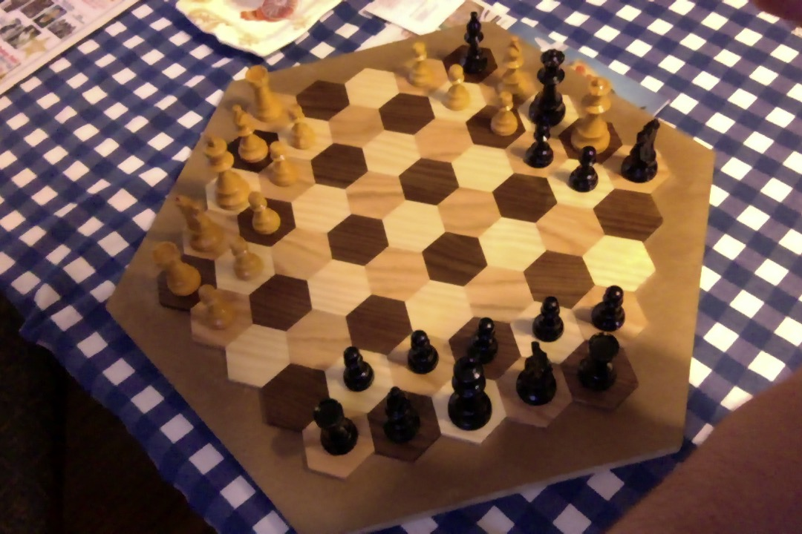

# hanb

``⬛️⬛️❄️⬛️⬛️⬛️⬛️⬛️⬛️⬛️❄️〰️❄️〰️❄️〰️🎅🏽〰️✨⬛️⬛️⬛️⬛️⬛️⬛️⬛️⬛❄️⬛️⬛️⬛️``  
``⬛️❄️❄️❄️⬛️⬛⬛️⬛️⬛️❄️〰️❄️〰️☃️〰️✨〰️✨〰️✨⬛️⬛️⬛️⬛️⬛️❄️❄️🐈❄️❄️⬛️``  
``❄️❄️💢❄️❄️⬛️⬛️⬛️❄️〰️🐈〰️❄️〰️❄️〰️🏘️〰️☃️〰️✨⬛️⬛️⬛️❄️✨✨🎁✨✨❄️``  
``❄️❄️❄️❄️❄️⬛️⬛️❄️〰️❄️〰️❄️〰️✨〰️🏘️〰️❄️🍋✨〰️✨⬛️⬛️❄️🎁🏘️🎁✨✨❄️``  
``❄️❄️❄️❄️❄️⬛️❄️〰️❄️〰️🏢〰️✨〰️🏚️〰️🏚️〰️❄️〰️✨〰️✨⬛️❄️✨🎁🎁✨✨❄️``  
``⬛️❄️❄️💢⬛️⬛️⬛️❄️〰️🏢〰️✨〰️🏚️〰️🏚️〰️❄️〰️✨〰️✨⬛️⬛️⬛️❄️❄️❄️❄️❄️⬛``  
``⬛️⬛️❄️⬛️⬛️⬛️⬛️⬛️❄️〰️🏘️〰️🏚️〰️🏚️〰️🎁〰️🎁〰️✨⬛️↖️⬛️↗️⬛️⬛️❄️⬛️⬛️⬛️``  
``⬛️⬛️⬛️⬛️⬛️⬛️⬛️⬛️⬛️❄️〰️❄️〰️🏚️〰️🎁〰️🎁〰️🎁⬛️⬛️⬅️2️⃣➡️⬛️⬛️⬛️⬛️⬛️⬛️``  
``⬛️⬛️⬛️⬛️⬛️⬛️⬛️⬛️⬛️⬛️❄️〰️❄️〰️🏚️〰️🐁〰️🎁⬛️⬛️⬛️↙️⬛️↘️⬛️⬛️⬛️⬛️⬛️⬛️``

* hanb is a simple language for creating model universes at any scale  
* hanb can be used with or without a computer  
* if you know the alphabet then you can use hanb  

the basis of the hanb system is a 61-cell hexagonal board:

``         a   a   a   a   a         ``  
``       a   a   a   a   a   a       ``  
``     a   a   a   a   a   a   a     ``  
``   a   a   a   a   a   a   a   a   ``  
`` a   a   a   a   a   a   a   a   a ``  
``   a   a   a   a   a   a   a   a   ``  
``     a   a   a   a   a   a   a     ``  
``       a   a   a   a   a   a       ``  
``         a   a   a   a   a         `` 

``                     a                     ``  
``                a         a                ``  
``           a         a         a           ``  
``      a         a         a         a      ``  
`` a         a         a         a         a ``  
``      a         a         a         a      ``  
`` a         a         a         a         a ``  
``      a         a         a         a      ``  
`` a         a         a         a         a ``  
``      a         a         a         a      ``  
`` a         a         a         a         a ``  
``      a         a         a         a      ``  
`` a         a         a         a         a ``  
``      a         a         a         a      ``  
``           a         a         a           ``  
``                a         a                ``  
``                     a                     ``  

each cell contains a single character from a set of 64 total characters:

a-z, A-Z, 0-9, - and .

boards can be written in a compressed form as 61-character strings, e.g.:

``tFZ2fD1LbWJYCkaB-feYB7wkEVjINP.-taGiY8iAef7R1noBhM-uz.Bdwgmld``  

``lmXDMBOHISwvumSev7rZtf449JmaUfPIN0EGWHK-yu782UobkdRNNhrkkDVTS``  

``acuXsBJ18dV-dXTD3pi8hDD6_bDFIQ94wi9vFNbZyCa3ZL8NNN6Bb2zVzoqRE``  

``fMTNqDeeIKrPQAqveHdY5.BZRDtHxMDlotxyR3y2Cy-5VnrnDpxX6Ssk1LRps``  

``19i7oMvDURxQzfHiVVCbA4dL278J-XvPfgL.rTOgcQrrK03nlCBJ3RMXHdOyP``  

``aYfqpEOK1s5gtDE-ocemVoUH45Ef88Pp9POLKF7cH97WADGBa2dBC6kL6wljU``  

``t7t82Ry18okmA1HCr0R8zi0HncVQyGtTo5xGo-44PXA4NRK0ND-sbVrT8fJMt``  

Each board represents a finite space at a particular scale between 0 and 63,
also represented by the above character set, such that 'a' is a board filled
with quantum foam and '.' is a board containing one or more universes

therefore we call 'a' a quantum foam container or a quantum foam particle
and '.' a universe container or universe

hanb board sizes increase by a factor of 10 with each character, e.g.

1x10^-10 meters or 1 Angstrom is represented by A  

1x10^-9 meters or 1 nanometer is represented by B  

...  

1x10^-6 meters or 1 micrometer is represented by E

...

1x10^-3 meters or 1 millimeter is represented by H  

1x10^-2 meters or 1 centimeter is represented by I  

...  

1x10^0 meters or 1 meter is represented by K  

and so on up to the maximum size of '.' (1 Rm = 1 x 10^27 m, size of universe) 

hanb is based on our actual universe but is highly simplified to allow for different kinds of
relationships to be tested at different scales without requiring a large amount of storage space

hanb can be used for a variety of modeling applications, including computer games,
social relationship simulations, terrain visualizations and other types of projects requiring
large dynamic spaces in limited memory

`a` -- quantum foam particle  

`b` -- Planck particle  

`c`  

`d`  

`e`  

`f`  

`g` (1 qm) 

`h`  

`i`  

`j` (1 rm) 

`k`  

`l`  

`m` (1 ym) 

`n`  

`o`  

`p` (1 zm) 

`q`  

`r`  

`s` (1 am) 

`t`  

`u`  

`v` (1 fm)

`w`  

`x`  

`y` (1 pm)

`z`  

`A` -- Angstrom ("atom") (10^−10 meters)  

`B` -- small molecule (1 nm)  

`C` --  

`D` --  

`E` -- 1 µm  

`F` -- 10µm Finehair (human hair bet. 17 and 180 µm diameter)    

`G` -- pixel (.1 mm = 100 µm)  (.26mm used in CSS so hanb pixel is slightly smaller)

`H` -- "hair" (1 mm)

`I` -- "insect" / coin size (1 cm)  

`J` -- "jar" (10 cm) 

`K` -- person (1 m) 

`L` -- lot (10 m) 

`M` -- hamlet (100 m) 

`N` -- neighborhood (1 km)  

`O` -- borough (10 km) 

`P` -- province (100 km) 

`Q` -- continent (1 Mm) 

`R` -- planet (10 Mm)  

`S` -- planet-moon system (100 Mm) (light second = 2.998e+8 m)

`T` -- 1 Gm (~ diameter of sun) (3 light seconds)

`U` -- 10 Gm (1 lightminute = 1.799e+10 m)

`V` -- 100 Gm (distance to Venus) 

`W` -- 1 Tm (1 lighthour = 1,079e+12m) 

`X` -- 10 Tm (complete star system) (light day = 2,59e+13)  

`Y` -- 100 Tm (1 light week = 1,813e+14)

`Z` -- 1 Pm (about 1 light month, 7,771e+14)

`0` -- 10^16 m (about 1 lightyear, 9,461e+15 m)  

`1` -- 10^17 (10 lightyears = 9.461e+16 m)

`2` -- 1 Em (100 lightyears = 9.461e+17)

`3` -- 10 Em (1000 lightyears = 9,461e+18) 

`4` -- 100 Em small galaxy (10,000 lightyears = 9.4607e+19)

`5` -- 1 Zm small galaxy (100,000 lightyears = 9.46073e+20m)

`6` -- galaxy (1 million lightywears = 9.46073e+21)  

`7` -- galaxy cluster (~10 million light years)

`8` -- small supercluster 1 Ym (~100 million light years)

`9` -- large supercluster (1 billion light years)

`-` -- filament (10 billion light years)
 
`.` -- universe (1 Rm = 1 x 10^27 m) (100 billion light years)
contained in `#` (matrix) board -- 10 Rm -- (1 trillion light years)

--

@ -- 100 Rm -- (10 trillion light years)
& -- (10^30 m = 1 Qm) (100 trillion light years)

--

# situations and events

The basis for movement in hanb is the relationship between situations and events.
A situation is a hanb board that is described in terms of object positions and object types (use one 64-character string for position as above
and a second 64-character string to define object types):

`bdhdjsskjhbsdgyuulskjhddfsghdjjjhgfdhjgkjskjhgdgdhjdkjhgshgdhPPP`
`ddfgljhgelrufhfhfhuurlkjhffhdjklkjheghjdkjhgdf7876dljhfffjjdg111`

An event is the transition from one situation to a different situation in terms of position and/or type, e.g.

`bdhdjsskjhbsdgyuulskjhddfsghdjjjhgfdhjgkjskjhgdgdhjdkjhgshgdhPPP`
`ddfgljhgelrufhfhfhuurlkjhffhdjklkjheghjdkjhgdf7876dljhfffjjdg111`

--->

`HdhdjsskjhbsdgyuulskjhddfsghdjjjhgfdhjgkjskjhgdgdhjdkjhgshgdhPPP`
`ddfgljhgelrufhfhfhuurlkjhffhdjklkjheghjdkjhgdf7876dljhfffjjdg111`

In the above example, the position string has been altered by one character, such that cell 0 has changed from
object size 'b' to object size 'H'

# hanb replacement language
describe objects at any resolution, combine various resolutions in any way

examples:  

apple  -- size J  
-- contains high detail sections of size I  
-- some I sections have very high detail sections size H  
-- some of those sections have pixel detail sections size G  

generating apple:  
-- generate J (apple)  

board='J' 

-- replace J with 61 I cells  

J -> dUp5R4nvFuBGHUDlMg1JyX8ID8H5Znwo82RoF0myOcUhjRjwORaoIJCcZnEsG

-- replace I cells with H cells

board='dUp5R4nvFuBGHUDlMg1JyX8ID8H5Znwo82RoF0myOcUhjRjwORaoIJCcZnEsG'  
for char in board  
  char -> lookup(char)

-- replace H cells with G cells (pixels)  
for char in board  
  char -> lookup(char)

-G returns RGB

automobile  -- size K  
-- steering wheel size J  
-- tire size J  
-- hood ornament size I  

city  -- size O  
continent  -- size Q  
planet  -- size R  

# time in hanb

`a` -- Planck time particle  

`b` --   

`c`  

`d`  

`e`  

`f`  

`g`  

`h`  

`i`  

`j`  

`k`  

`l`  

`m`  

`n`  

`o`  

`p`  

`q`  

`r`  

`s`  

`t`  

`u`  

`v`  

`w`  

`x`  

`y`  

`z` -- 1 million yrs

`A` -- <1 billion yrs  

`B` --  >1 billion yrs

`C` -- 1 trillion yrs

`D` -- 1 quadrillion yrs

`E` --    

`F` --    

`G` --   

`H` --  

`I` --   

`J` --   

`K` --   

`L` --1e100 yrs   

`M` --   

`N` --   

`O` --  

`P` --   

`Q` --  

`R` --   

`S` -- 

`T`  

`U`  

`V`  1e1000 yrs = heat death

`W`  

`X` -- 

`Y`  

`Z`  

`0`  

`1`  

`2`  

`3`  

`4`  

`5`  

`6` -- 

`7`  

`8`  

`9`  

`-` --  

`.` -- 

# Implementing hanb
# physical
# digital
# hanb text mode
# hanb graphics
# unicode hanb
# genetic hanb

# storage benefits  

one board is 61 cells x 1 byte / cell = 61 bytes  
exponent of level of resolution

board size L at resolution  
0: 61^0 = 1 byte (component of larger board M)  
1: 61^1 = 61 bytes (L with K details)  
2: 61^2 = 3721 bytes (L with J details)  
3: 61^3 = 226981 bytes (L with I details)  
4: 61^4 = 13.8 MB (L with H details)  
5: 61^5 = 845 MB (L with G details, pixel level detail)  

hanb translation palettes save memory:  

L -> KKKKKKKKKKKKKKKKKKK  
K -> JJJJJJJJJJJJJJJJJJJ  
J -> IIIIIIIIIIIIIIIIIII  

hanb
translation palette 0 (M cell -> 61 L cells) -- 3904 bytes (61 cell maps for each of 64 possible characters)  

translation palette 1 (L cell -> 61 K cells) -- 3904 bytes   
translation palette 2 (K cell -> 61 J cells) -- 3904 bytes   
translation palette 3 (J cell -> 61 I cells) -- 3904 bytes   
translation palette 4 (I cell -> 61 H cells) -- 3904 bytes   
translation palette 5 (H cell -> 61 G cells) -- 3904 bytes     

3904 x 5 = 19520 bytes    

# 64-character strings

using 64 bytes for each cell (reserve 3 additional bytes for RGB color information):  
64^2 = 4096    
4096 x 5 = 20480 bytes   

A 3-character return value is appended to each 61-character string to allow for a base case
in situations that do not allow a board to be resolved fully:

`AAAAAAAAAAAAAAAAAAAAAAAAAAAAAAAAAAAAAAAAAAAAAAAAAAAAAAAAAAAAA555`

In the above example, the string of A characters represents the cell values, and the string "555" at the end is a return value.
In this way an RGB color value or other types on information can be returned with each board as an alternative to displaying the board.
 

# Use cases
# simple rpg example

generate scope replacement palettes a-z, A-Z, 0-9, - .

a -> jHtsb3VjW2bLgToIqvMyJSiz2dvYKT4MOayOO8HjWQ8Jzvnm1YzWbA3CvEoA1  
b -> pwc0SwumO0nTW9aHCtyRU8PZBDUwDYWFeEbsuFfw5Bn8W6dl8xmuGAdzYwHpx  

...

9 -> GCYLqcob3AXPStlz2oaPNvcUPz35ZTJaX506vtYZQkVKTC8s2E2AsERZDF0qr  
_ -> 6weMksPXE7kyap1Q8wxij0ttLn6gHSu9n01k0hENnCCrHf7Zs0Xy9srvnzz6b  
. -> HWwpihtNApIJwZ2wZakSWo2K9WjsxvSnlFCGfamR3GsVeie9Eo3eQhvuBoIUP  

generate character K  
wZcgQZaWrht6a6rEWLLbcxGbS6rjUPFKBtLrRt8eLNlzxJf0WNiQ5LeIWOXrc

``🍁🍁🍁🍁🌿🍁🌿🍁🌿🍁🌿🍁🌿🍁🍁🍁🍁``  
``🍁🍁🍁🌿🍁🌿🍁🌿🍁🌿🍁🌿🍁🌿🍁🍁🍁``  
``🍁🍁🌿🍁🌿🍁🌿🍁📜🍁🌿🍁🌿🍁🌿🍁🍁``  
``🍁🌿🍁🌿🍁🌿🍁📜🍁📜🍁🌿🍁🌿🍁🌿🍁``  
``🌿🍁🌿🍁🌿🍁🌿🍁🤵‍♂️🍁🧤🍁🌿🍁🌿🍁🌿``  
``🍁🌿🍁🌿🍁🧤🍁📜🍁📜🍁🌿🍁🌿🍁🌿🍁``  
``🍁🍁🌿🍁🌿🍁🌿🍁📜🍁📜🍁🌿🍁🌿🍁🍁``  
``🍁🍁🍁🌿🍁🌿🍁📜🍁📜🍁🌿🍁🌿🍁🍁🍁``  
``🍁🍁🍁🍁🌿🍁🥾🍁📜🍁🥾🍁🌿🍁🍁🍁🍁``

generate weapon J  
S5pl9pE1I37bVazv52AyZiJCnBzLeRwpelSv28oeo9MVHG7zKvnhWBi2ZoHfv

``🍁🍁🍁🍁🌿🍁🌿🍁⏸🍁🌿🍁🌿🍁🍁🍁🍁``  
``🍁🍁🍁🌿🍁🌿🍁🌿🍁🌿🍁🌿🍁🌿🍁🍁🍁``  
``🍁🍁🌿🍁🌿🍁🌿🍁⏸🍁🌿🍁🌿🍁🌿🍁🍁``  
``🍁🌿🍁🌿🍁🌿🍁🌿🍁🌿🍁🌿🍁🌿🍁🌿🍁``  
``🌿🍁🌿🍁🌿🍁🌿🍁⏸🍁🌿🍁🌿🍁🌿🍁🌿``  
``🍁🌿🍁🌿🍁🌿🍁🌿🍁🌿🍁🌿🍁🌿🍁🌿🍁``  
``🍁🍁🌿🍁🌿🍁💠🍁🔴🍁💠🍁🌿🍁🌿🍁🍁``  
``🍁🍁🍁🌿🍁🌿🍁🌿🍁🌿🍁🌿🍁🌿🍁🍁🍁``  
``🍁🍁🍁🍁🌿🍁🌿🍁💎🍁🌿🍁🌿🍁🍁🍁🍁``

generate magic ring I  
``aaHaaaaGGaaaaFFFaaaaFaaFaaaaFaaaFaaaaFaaFaaaaFaFaaaaFFaaaaaaa``  

``🍁🍁🍁🍁🍁🍁🍁🍁🌿🍁🌿🍁💠🍁🌿🍁🌿🍁🍁🍁🍁🍁🍁🍁🍁🍁``    
``🍁🍁🍁🍁🍁🍁🍁🌿🍁🌿🍁🔸🍁🔸🍁🌿🍁🌿🍁🍁🍁🍁🍁🍁🍁🍁``    
``🍁🍁🍁🍁🍁🍁🌿🍁🌿🍁🌀🍁🌀🍁🌀🍁🌿🍁🌿🍁🍁🍁🍁🍁🍁🍁``    
``🍁🍁🍁🍁🍁🌿🍁🌿🍁🌀🍁🌿🍁🌿🍁🌀🍁🌿🍁🌿🍁🍁🍁🍁🍁🍁``    
``🍁🍁🍁🍁🌿🍁🌿🍁🌀🍁🌿🍁🌿🍁🌿🍁🌀🍁🌿🍁🌿🍁🍁🍁🍁🍁``    
``🍁🍁🍁🍁🍁🌿🍁🌿🍁🌀🍁🌿🍁🌿🍁🌀🍁🌿🍁🌿🍁🍁🍁🍁🍁🍁``    
``🍁🍁🍁🍁🍁🍁🌿🍁🌿🍁🌀🍁🌿🍁🌀🍁🌿🍁🌿🍁🍁🍁🍁🍁🍁🍁``    
``🍁🍁🍁🍁🍁🍁🍁🌿🍁🌿🍁🌀🍁🌀🍁🌿🍁🌿🍁🍁🍁🍁🍁🍁🍁🍁``    
``🍁🍁🍁🍁🍁🍁🍁🍁🌿🍁🌿🍁🌿🍁🌿🍁🌿🍁🍁🍁🍁🍁🍁🍁🍁🍁``   

generate
closely inspect H  
6J50bQJ0CRr68KkPcS8ig5H2S0fVG5iZyCuICJVzBfOVyWrCESQKov4gXDotP

-----

simulated walking map L  
aaaaaKaaaaaKKaaKKaaaaaKaaaaaaaKaaaJaaaaaaaaaaaJaaaaJaaJaaaaaa   
``▗▗▗▗▗▗▗▗a.a.a.a.a.▗▗▗▗▗▗▗▗``  
``▗▗▗▗▗▗▗K.a.a.a.a.a.▗▗▗▗▗▗▗``  
``▗▗▗▗▗▗K.K.a.a.K.K.a.▗▗▗▗▗▗``  
``▗▗▗▗▗a.a.a.a.K.a.a.a.▗▗▗▗▗``  
``▗▗▗▗a.a.a.a.K.a.a.a.J.▗▗▗▗``  
``▗▗▗▗▗a.a.a.a.a.a.a.a.▗▗▗▗▗``  
``▗▗▗▗▗▗a.a.a.J.a.a.a.▗▗▗▗▗▗``  
``▗▗▗▗▗▗▗a.J.a.a.J.a.▗▗▗▗▗▗▗``  
``▗▗▗▗▗▗▗▗a.a.a.a.a.▗▗▗▗▗▗▗▗`` 

simulated hamlet overmap M  
aaaaaaaaKaaaKaaaLaaaaLaaaaaaaaaaaLaaaLaaaaaaaaaaLaaKaKaaaaaaa  
``▗▗▗▗▗▗▗▗a.a.a.a.a.▗▗▗▗▗▗▗▗``  
``▗▗▗▗▗▗▗a.a.a.K.a.a.▗▗▗▗▗▗▗``  
``▗▗▗▗▗▗a.K.a.a.a.L.a.▗▗▗▗▗▗``  
``▗▗▗▗▗a.a.a.L.a.a.a.a.▗▗▗▗▗``  
``▗▗▗▗a.a.a.a.a.a.a.L.a.▗▗▗▗``  
``▗▗▗▗▗a.a.L.a.a.a.a.a.▗▗▗▗▗``  
``▗▗▗▗▗▗a.a.a.a.a.L.a.▗▗▗▗▗▗``  
``▗▗▗▗▗▗▗a.K.a.K.a.a.▗▗▗▗▗▗▗``  
``▗▗▗▗▗▗▗▗a.a.a.a.a.▗▗▗▗▗▗▗▗`` 

simulated village quest map N  
aaaaaaaaaaaaaaMaMaaaaaaaaaaaaaMaaaaaaaaaaMaaaLaaaLaaaMaaaaaaa  
``▗▗▗▗▗▗▗▗a.a.a.a.a.▗▗▗▗▗▗▗▗``  
``▗▗▗▗▗▗▗a.a.a.a.a.a.▗▗▗▗▗▗▗``  
``▗▗▗▗▗▗a.a.a.M.a.M.a.▗▗▗▗▗▗``  
``▗▗▗▗▗a.a.a.a.a.a.a.a.▗▗▗▗▗``  
``▗▗▗▗a.a.a.a.M.a.a.a.a.▗▗▗▗``  
``▗▗▗▗▗a.a.a.a.a.a.M.a.▗▗▗▗▗``  
``▗▗▗▗▗▗a.a.L.a.a.a.L.▗▗▗▗▗▗``  
``▗▗▗▗▗▗▗a.a.a.M.a.a.▗▗▗▗▗▗▗``  
``▗▗▗▗▗▗▗▗a.a.a.a.a.▗▗▗▗▗▗▗▗`` 

``🍁🍁🍁🍁🍁🍁🍁🍁🌿🍁🌿🍁🌿🍁🌿🍁🌿🍁🍁🍁🍁🍁🍁🍁🍁🍁``    
``🍁🍁🍁🍁🍁🍁🍁🌿🍁🌿🍁🌿🍁🌿🍁🌿🍁🌿🍁🍁🍁🍁🍁🍁🍁🍁``    
``🍁🍁🍁🍁🍁🍁🌿🍁🌿🍁🌿🍁🏘️🍁🌿🍁🏘️🍁🌿🍁🍁🍁🍁🍁🍁🍁``    
``🍁🍁🍁🍁🍁🌿🍁🌿🍁🌿🍁🌿🍁🌿🍁🌿🍁🌿🍁🌿🍁🍁🍁🍁🍁🍁``    
``🍁🍁🍁🍁🌿🍁🌿🍁🌿🍁🌿🍁🏘️🍁🌿🍁🌿🍁🌿🍁🌿🍁🍁🍁🍁🍁``    
``🍁🍁🍁🍁🍁🌿🍁🌿🍁🌿🍁🌿🍁🌿🍁🌿🍁🏘️🍁🌿🍁🍁🍁🍁🍁🍁``    
``🍁🍁🍁🍁🍁🍁🌿🍁🌿🍁🏠🍁🌿🍁🌿🍁🌿🍁🏠🍁🍁🍁🍁🍁🍁🍁``    
``🍁🍁🍁🍁🍁🍁🍁🌿🍁🌿🍁🌿🍁🏘️🍁🌿🍁🌿🍁🍁🍁🍁🍁🍁🍁🍁``    
``🍁🍁🍁🍁🍁🍁🍁🍁🌿🍁🌿🍁🌿🍁🌿🍁🌿🍁🍁🍁🍁🍁🍁🍁🍁🍁``   

simulated city map O  
aaaaaAAAANaaaaaNaaaaKMaKAaaaaaNaaKaaaLLaAAAAAMAAMAAAALLAAAAAA  
``▗▗▗▗▗▗▗▗a.a.a.a.a.▗▗▗▗▗▗▗▗``  
``▗▗▗▗▗▗▗A.A.A.A.N.a.▗▗▗▗▗▗▗``  
``▗▗▗▗▗▗a.a.a.a.N.a.a.▗▗▗▗▗▗``  
``▗▗▗▗▗a.a.K.M.a.K.A.a.▗▗▗▗▗``  
``▗▗▗▗a.a.a.a.N.a.a.K.a.▗▗▗▗``  
``▗▗▗▗▗a.a.L.L.a.A.A.A.▗▗▗▗▗``  
``▗▗▗▗▗▗A.A.M.A.A.M.A.▗▗▗▗▗▗``  
``▗▗▗▗▗▗▗A.A.A.L.L.A.▗▗▗▗▗▗▗``  
``▗▗▗▗▗▗▗▗A.A.A.A.A.▗▗▗▗▗▗▗▗`` 

simulated kingdom P  
aaaaaaAAMOKaaKaAAaaONNaaOaaAANOMaAaaaaaKaaaaaMAAMaaLAAOaaaaaa  
``▗▗▗▗▗▗▗▗a.a.a.a.a.▗▗▗▗▗▗▗▗``  
``▗▗▗▗▗▗▗a.A.A.M.O.K.▗▗▗▗▗▗▗``  
``▗▗▗▗▗▗a.a.K.a.A.A.a.▗▗▗▗▗▗``  
``▗▗▗▗▗a.O.N.N.a.a.O.a.▗▗▗▗▗``  
``▗▗▗▗a.A.A.N.O.M.a.A.a.▗▗▗▗``  
``▗▗▗▗▗a.a.a.a.K.a.a.a.▗▗▗▗▗``  
``▗▗▗▗▗▗a.a.M.A.A.M.a.▗▗▗▗▗▗``  
``▗▗▗▗▗▗▗a.L.A.A.O.a.▗▗▗▗▗▗▗``  
``▗▗▗▗▗▗▗▗a.a.a.a.a.▗▗▗▗▗▗▗▗`` 

simulated continent Q  
AAAAAAAAAPAAAAPAAAAAAAAAAAAAAPAAAAAAAAPAAPAAAAAAAAAAAAAAAAAA  
``▗▗▗▗▗▗▗▗A.A.A.A.A.▗▗▗▗▗▗▗▗``  
``▗▗▗▗▗▗▗A.A.A.A.P.A.▗▗▗▗▗▗▗``  
``▗▗▗▗▗▗A.A.A.P.A.A.A.▗▗▗▗▗▗``  
``▗▗▗▗▗A.A.A.A.A.A.A.A.▗▗▗▗▗``  
``▗▗▗▗A.A.A.P.A.A.A.A.A.▗▗▗▗``  
``▗▗▗▗▗A.A.A.P.A.A.P.A.▗▗▗▗▗``  
``▗▗▗▗▗▗A.A.A.A.A.A.A.▗▗▗▗▗▗``  
``▗▗▗▗▗▗▗A.A.A.A.A.A.▗▗▗▗▗▗▗``  
``▗▗▗▗▗▗▗▗A.A.A.A.A.▗▗▗▗▗▗▗▗`` 

simulated planet R  
AAAAAAAAQAAAQAQQAAAQAAAQAAAAAAAAAAAAAQQQAAAAAAQAAAAAAAAAAAAA  
``▗▗▗▗▗▗▗▗A.A.A.A.A.▗▗▗▗▗▗▗▗``  
``▗▗▗▗▗▗▗A.A.A.A.Q.A.▗▗▗▗▗▗▗``  
``▗▗▗▗▗▗A.A.Q.A.Q.Q.A.▗▗▗▗▗▗``  
``▗▗▗▗▗A.A.Q.A.A.A.Q.A.▗▗▗▗▗``  
``▗▗▗▗A.A.A.A.A.A.A.A.A.▗▗▗▗``  
``▗▗▗▗▗A.A.A.Q.Q.Q.A.A.▗▗▗▗▗``  
``▗▗▗▗▗▗A.A.A.A.Q.A.A.▗▗▗▗▗▗``  
``▗▗▗▗▗▗▗A.A.A.A.A.A.▗▗▗▗▗▗▗``  
``▗▗▗▗▗▗▗▗A.A.A.A.A.▗▗▗▗▗▗▗▗`` 

# tourist map of city
``▗▗▗▗▗▗▗▗A.A.A.A.A.▗▗▗▗▗▗▗▗``  
``▗▗▗▗▗▗▗A.A.A.L.M.A.▗▗▗▗▗▗▗``  
``▗▗▗▗▗▗A.A.A.A.N.A.A.▗▗▗▗▗▗``  
``▗▗▗▗▗K.K.K.K.K.K.K.K.▗▗▗▗▗``  
``▗▗▗▗A.A.M.A.A.A.A.A.A.▗▗▗▗``  
``▗▗▗▗▗a.a.L.A.L.A.A.A.▗▗▗▗▗``  
``▗▗▗▗▗▗A.A.A.A.A.M.A.▗▗▗▗▗▗``  
``▗▗▗▗▗▗▗a.a.a.N.N.L.▗▗▗▗▗▗▗``  
``▗▗▗▗▗▗▗▗A.A.A.A.A.▗▗▗▗▗▗▗▗``  

#
# model of Solar System  
``▗▗▗▗▗▗▗▗A.A.A.A.R.▗▗▗▗▗▗▗▗``  
``▗▗▗▗▗▗▗A.A.A.A.R.A.▗▗▗▗▗▗▗``  
``▗▗▗▗▗▗A.Q.A.A.R.A.A.▗▗▗▗▗▗``  
``▗▗▗▗▗A.A.A.A.R.A.A.A.▗▗▗▗▗``  
``▗▗▗▗A.A.A.A.X.A.A.A.R.▗▗▗▗``  
``▗▗▗▗▗A.A.A.A.A.A.A.A.▗▗▗▗▗``  
``▗▗▗▗▗▗A.A.A.A.R.A.A.▗▗▗▗▗▗``  
``▗▗▗▗▗▗▗A.A.A.A.A.A.▗▗▗▗▗▗▗``  
``▗▗▗▗▗▗▗▗A.Q.A.A.A.▗▗▗▗▗▗▗▗``  

# model of Milky Way  (5 × 10^20 m radius)
``▗▗▗▗▗▗▗▗-.3.3.-.-.▗▗▗▗▗▗▗▗``  
``▗▗▗▗▗▗▗-.3.-.-.3.3.▗▗▗▗▗▗▗``  
``▗▗▗▗▗▗-.3.-.3.3.-.-.▗▗▗▗▗▗``  
``▗▗▗▗▗-.-.3.3.3.-.3.-.▗▗▗▗▗``  
``▗▗▗▗-.3.-.3.3.3.3.-.-.▗▗▗▗``  
``▗▗▗▗▗-.3.3.3.3.3.-.-.▗▗▗▗▗``  
``▗▗▗▗▗▗-.-.-.-.-.3.-.▗▗▗▗▗▗``  
``▗▗▗▗▗▗▗-.-.-.3.-.-.▗▗▗▗▗▗▗``  
``▗▗▗▗▗▗▗▗-.3.-.-.-.▗▗▗▗▗▗▗▗``  

``✨✨✨✨✨✨✨✨🌌✨🌟✨🌟✨🌌✨🌌✨✨✨✨✨✨✨✨✨``  
``✨✨✨✨✨✨✨🌌✨🌟✨🌌✨🌌✨🌟✨🌟✨✨✨✨✨✨✨✨``  
``✨✨✨✨✨✨🌌✨🌟✨🌌✨🌟✨🌟✨🌌✨🌌✨✨✨✨✨✨✨``  
``✨✨✨✨✨🌌✨🌌✨🌟✨🌟✨🌟✨🌌✨🌟✨🌌✨✨✨✨✨✨``  
``✨✨✨✨🌌✨🌟✨🌌✨🌟✨🌟✨🌟✨🌟✨🌌✨🌌✨✨✨✨✨``  
``✨✨✨✨✨🌌✨🌟✨🌟✨🌟✨🌟✨🌟✨🌌✨🌌✨✨✨✨✨✨``  
``✨✨✨✨✨✨🌌✨🌌✨🌌✨🌌✨🌌✨🌟✨🌌✨✨✨✨✨✨✨``  
``✨✨✨✨✨✨✨🌌✨🌌✨🌌✨🌟✨🌌✨🌌✨✨✨✨✨✨✨✨``  
``✨✨✨✨✨✨✨✨🌌✨🌟✨🌌✨🌌✨🌌✨✨✨✨✨✨✨✨✨``  

# model of Lithium atom (radius 182pm -> 1 Angstrom = 1pm so 100A -> B+) 
``▗▗▗▗▗▗▗▗-.-.-.-.-.▗▗▗▗▗▗▗▗``  
``▗▗▗▗▗▗▗-.-.-.-.-.-.▗▗▗▗▗▗▗``  
``▗▗▗▗▗▗-.-.-.-.-.-.-.▗▗▗▗▗▗``  
``▗▗▗▗▗-.-.-.v.v.-.-.-.▗▗▗▗▗``  
``▗▗▗▗-.v.-.v.v.v.-.v.-.▗▗▗▗``  
``▗▗▗▗▗-.-.-.v.v.-.-.-.▗▗▗▗▗``  
``▗▗▗▗▗▗-.-.-.-.-.-.-.▗▗▗▗▗▗``  
``▗▗▗▗▗▗▗-.-.-.-.-.-.▗▗▗▗▗▗▗``  
``▗▗▗▗▗▗▗▗-.-.v.-.-.▗▗▗▗▗▗▗▗``  

``🥛🥛🥛🥛🥛🥛🥛🥛✨🥛✨🥛✨🥛✨🥛✨🥛🥛🥛🥛🥛🥛🥛🥛🥛``   
``🥛🥛🥛🥛🥛🥛🥛✨🥛✨🥛✨🥛✨🥛✨🥛✨🥛🥛🥛🥛🥛🥛🥛🥛``   
``🥛🥛🥛🥛🥛🥛✨🥛✨🥛✨🥛✨🥛✨🥛✨🥛✨🥛🥛🥛🥛🥛🥛🥛``   
``🥛🥛🥛🥛🥛✨🥛✨🥛✨🥛🎁🥛🎁🥛✨🥛✨🥛✨🥛🥛🥛🥛🥛🥛``   
``🥛🥛🥛🥛✨🥛🎁🥛✨🥛🎁🥛🎁🥛🎁🥛✨🥛🎁🥛✨🥛🥛🥛🥛🥛``   
``🥛🥛🥛🥛🥛✨🥛✨🥛✨🥛🎁🥛🎁🥛✨🥛✨🥛✨🥛🥛🥛🥛🥛🥛``   
``🥛🥛🥛🥛🥛🥛✨🥛✨🥛✨🥛✨🥛✨🥛✨🥛✨🥛🥛🥛🥛🥛🥛🥛``   
``🥛🥛🥛🥛🥛🥛🥛✨🥛✨🥛✨🥛✨🥛✨🥛✨🥛🥛🥛🥛🥛🥛🥛🥛``   
``🥛🥛🥛🥛🥛🥛🥛🥛✨🥛✨🥛🎁🥛✨🥛✨🥛🥛🥛🥛🥛🥛🥛🥛🥛``   

# model of quark (size 'u')  
``▗▗▗▗▗▗▗▗t.t.t.t.t.▗▗▗▗▗▗▗▗``  
``▗▗▗▗▗▗▗t.t.t.t.t.t.▗▗▗▗▗▗▗``  
``▗▗▗▗▗▗t.t.t.t.t.t.t.▗▗▗▗▗▗``  
``▗▗▗▗▗t.t.t.t.t.t.t.t.▗▗▗▗▗``  
``▗▗▗▗t.t.t.t.t.t.t.t.t.▗▗▗▗``  
``▗▗▗▗▗t.t.t.t.t.t.t.t.▗▗▗▗▗``  
``▗▗▗▗▗▗t.t.t.t.t.t.t.▗▗▗▗▗▗``  
``▗▗▗▗▗▗▗t.t.t.t.t.t.▗▗▗▗▗▗▗``  
``▗▗▗▗▗▗▗▗t.t.t.t.t.▗▗▗▗▗▗▗▗``  

# hanb and base 64
https://en.wikipedia.org/wiki/Base64

ABCDEFGHIJKLMNOPQRSTUVWXTZabcdefghijklmnopqrstuvwxyz0123456789+/

abcdefghijklmnopqrstuvwxyzABCDEFGHIJKLMNOPQRSTUVWXYZ0123456789-.

# more examples using unicode character replacement:

``🌾🌾🌾🌾🌾🌾🌾🌾🌺🌾🌺🌾🌺🌾🌺🌾🌺🌾🌾🌾🌾🌾🌾🌾🌾🌾``  
``🌾🌾🌾🌾🌾🌾🌾🌺🌾🌺🌾🌺🌾🌺🌾🌺🌾🌺🌾🌾🌾🌾🌾🌾🌾🌾``  
``🌾🌾🌾🌾🌾🌾🌺🌾🌺🌾🌺🌾🌺🌾🌺🌾🌺🌾🌺🌾🌾🌾🌾🌾🌾🌾``  
``🌾🌾🌾🌾🌾🌺🌾🌺🌾🌺🌾🌺🌾🌺🌾🌺🌾🌺🌾🌺🌾🌾🌾🌾🌾🌾``  
``🌾🌾🌾🌾🌺🌾🌺🌾🌺🌾🌺🌾🌺🌾🌺🌾🌺🌾🌺🌾🌺🌾🌾🌾🌾🌾``  
``🌾🌾🌾🌾🌾🌺🌾🌺🌾🌺🌾🌺🌾🌺🌾🌺🌾🌺🌾🌺🌾🌾🌾🌾🌾🌾``  
``🌾🌾🌾🌾🌾🌾🌺🌾🌺🌾🌺🌾🌺🌾🌺🌾🌺🌾🌺🌾🌾🌾🌾🌾🌾🌾``  
``🌾🌾🌾🌾🌾🌾🌾🌺🌾🌺🌾🌺🌾🌺🌾🌺🌾🌺🌾🌾🌾🌾🌾🌾🌾🌾``  
``🌾🌾🌾🌾🌾🌾🌾🌾🌺🌾🌺🌾🌺🌾🌺🌾🌺🌾🌾🌾🌾🌾🌾🌾🌾🌾``  

``🌲🌲🌲🌲🌲🌲🌲🌲❄️🌲❄️🌲❄️🌲❄️🌲❄️🌲🌲🌲🌲🌲🌲🌲🌲🌲``  
``🌲🌲🌲🌲🌲🌲🌲❄️🌲❄️🌲❄️🌲❄️🌲❄️🌲❄️🌲🌲🌲🌲🌲🌲🌲🌲``  
``🌲🌲🌲🌲🌲🌲❄️🌲❄️🌲❄️🌲❄️🌲❄️🌲❄️🌲❄️🌲🌲🌲🌲🌲🌲🌲``  
``🌲🌲🌲🌲🌲❄️🌲❄️🌲❄️🌲❄️🌲❄️🌲❄️🌲❄️🌲❄️🌲🌲🌲🌲🌲🌲``  
``🌲🌲🌲🌲❄️🌲❄️🌲❄️🌲❄️🌲❄️🌲❄️🌲❄️🌲❄️🌲❄️🌲🌲🌲🌲🌲``  
``🌲🌲🌲🌲🌲❄️🌲❄️🌲❄️🌲❄️🌲❄️🌲❄️🌲❄️🌲❄️🌲🌲🌲🌲🌲🌲``  
``🌲🌲🌲🌲🌲🌲❄️🌲❄️🌲❄️🌲❄️🌲❄️🌲❄️🌲❄️🌲🌲🌲🌲🌲🌲🌲``  
``🌲🌲🌲🌲🌲🌲🌲❄️🌲❄️🌲❄️🌲❄️🌲❄️🌲❄️🌲🌲🌲🌲🌲🌲🌲🌲``  
``🌲🌲🌲🌲🌲🌲🌲🌲❄️🌲❄️🌲❄️🌲❄️🌲❄️🌲🌲🌲🌲🌲🌲🌲🌲🌲``

``🌲🌲🌲🌲🌲🌲🌲🌲❄️🌲❄️🌲❄️🌲❄️🌲❄️🌲🌲🌲🌲🌲🌲🌲🌲🌲``  
``🌲🌲🌲🌲🌲🌲🌲❄️🌲❄️🌲🐈🌲❄️🌲❄️🌲❄️🌲🌲🌲🌲🌲🌲🌲🌲``  
``🌲🌲🌲🌲🌲🌲❄️🌲🕳️🌲❄️🌲❄️🌲❤️🌲🐈🌲❄️🌲🌲🌲🌲🌲🌲🌲``  
``🌲🌲🌲🌲🌲❄️🌲❄️🌲❄️🌲❄️🌲❤️🌲❄️🌲⛳🌲❄️🌲🌲🌲🌲🌲🌲``  
``🌲🌲🌲🌲❄️🌲❄️🌲🐈🌲❄️🌲❄️🌲🐈🌲❄️🌲❄️🌲❄️🌲🌲🌲🌲🌲``  
``🌲🌲🌲🌲🌲❄️🌲❄️🌲❄️🌲❄️🌲❄️🌲🕳️🌲🐈🌲❄️🌲🌲🌲🌲🌲🌲``  
``🌲🌲🌲🌲🌲🌲❄️🌲❤️🌲⛳🌲❄️🌲❄️🌲❄️🌲❄️🌲🌲🌲🌲🌲🌲🌲``  
``🌲🌲🌲🌲🌲🌲🌲❄️🌲❄️🌲🐈🌲❄️🌲❄️🌲❄️🌲🌲🌲🌲🌲🌲🌲🌲``  
``🌲🌲🌲🌲🌲🌲🌲🌲❄️🌲❄️🌲❄️🌲❄️🌲❄️🌲🌲🌲🌲🌲🌲🌲🌲🌲``

``🌲🌲🌲🌲🌲🌲🌲🌲❄️🌲❄️🌲❄️🌲❄️🌲❄️🌲🌲🌲🌲🌲🌲🌲🌲🌲``  
``🌲🌲🌲🌲🌲🌲🌲❄️🌲❄️🌲🏢🌲❄️🌲❄️🌲🚫🌲🌲🌲🌲🌲🌲🌲🌲``  
``🌲🌲🌲🌲🌲🌲❄️🌲🕳️🌲❄️🌲❄️🌲🏘️🌲🏢🌲🚫🌲🌲🌲🌲🌲🌲🌲``  
``🌲🌲🌲🌲🌲❄️🌲❄️🌲❄️🌲❄️🌲🏘️🌲❄️🌲⛳🌲🚫🌲🌲🌲🌲🌲🌲``  
``🌲🌲🌲🌲❄️🌲❄️🌲🏢🌲❄️🌲🏚️🌲🏚️🌲❄️🌲🚫🌲🚫🌲🌲🌲🌲🌲``  
``🌲🌲🌲🌲🌲❄️🌲❄️🌲🏚️🌲🏚️🌲🏚️🌲🕳️🌲🏢🌲🚫🌲🌲🌲🌲🌲🌲``  
``🌲🌲🌲🌲🌲🌲❄️🌲🏘️🌲🏚️🌲🏚️🌲🏚️🌲☢️🌲🚫🌲🌲🌲🌲🌲🌲🌲``  
``🌲🌲🌲🌲🌲🌲🌲❄️🌲❄️🌲🏚️🌲🏚️🌲☢️🌲☢️🌲🌲🌲🌲🌲🌲🌲🌲``  
``🌲🌲🌲🌲🌲🌲🌲🌲❄️🌲❄️🌲🏚️🌲☢️🌲☢️🌲🌲🌲🌲🌲🌲🌲🌲🌲``
 
``🌊🌊🌊🌊🌊🌊🌊🌊🏝️🌊🏝️🌊🏝️🌊⛵🌊🏝️🌊🌊🌊🌊🌊🌊🌊🌊🌊``  
``🌊🌊🌊🌊🌊🌊🌊🏝️🌊🏝️🌊🐟🌊🏝️🌊🐳🌊🐳🌊🌊🌊🌊🌊🌊🌊🌊``  
``🌊🌊🌊🌊🌊🌊🏝️🌊⛵🌊🏝️🌊🐳🌊🏝️🌊🐳🌊🏝️🌊🌊🌊🌊🌊🌊🌊``  
``🌊🌊🌊🌊🌊🏝️🌊🐟🌊🐟🌊⛵🌊🐟🌊⛵🌊🏝️🌊🏝️🌊🌊🌊🌊🌊🌊``  
``🌊🌊🌊🌊🏝️🌊🏝️🌊🐟🌊🏝️🌊🏝️🌊🏝️🌊🐟🌊🏝️🌊🏝️🌊🌊🌊🌊🌊``  
``🌊🌊🌊🌊🌊🏝️🌊🏝️🌊🏝️🌊🏝️🌊🏝️🌊🏝️🌊⛵🌊🏝️🌊🌊🌊🌊🌊🌊``  
``🌊🌊🌊🌊🌊🌊🏝️🌊⛵🌊🐟🌊⛵🌊🏝️🌊🐟🌊🏝️🌊🌊🌊🌊🌊🌊🌊``  
``🌊🌊🌊🌊🌊🌊🌊🏝️🌊🏝️🌊🏝️🌊🏝️🌊🏝️🌊🏝️🌊🌊🌊🌊🌊🌊🌊🌊``  
``🌊🌊🌊🌊🌊🌊🌊🌊🏝️🌊🏝️🌊🏝️🌊🏝️🌊🏝️🌊🌊🌊🌊🌊🌊🌊🌊🌊`` 
 
 ``✨✨✨✨✨✨✨✨🇨🇦✨🇨🇦✨🇨🇦✨🇨🇦✨🇨🇦✨✨✨✨✨✨✨✨✨``  
``✨✨✨✨✨✨✨🇨🇦✨🇨🇦✨🇨🇦✨🇨🇦✨🇨🇦✨🇨🇦✨✨✨✨✨✨✨✨``  
``✨✨✨✨✨✨🇨🇦✨🇨🇦✨🇨🇦✨🇨🇦✨🇨🇦✨🇨🇦✨🇨🇦✨✨✨✨✨✨✨``  
``✨✨✨✨✨🇨🇦✨🇨🇦✨🇨🇦✨🇨🇦✨🇨🇦✨🇨🇦✨🇨🇦✨🇨🇦✨✨✨✨✨✨``  
``✨✨✨✨🇺🇸✨🇺🇸✨🇨🇦✨🇨🇦✨🇨🇦✨🇨🇦✨🇨🇦✨🇨🇦✨🇨🇦✨✨✨✨✨``  
``✨✨✨✨✨🇺🇸✨🇺🇸✨🇨🇦✨🇺🇸✨🇺🇸✨🇨🇦✨🇨🇦✨🇺🇸✨✨✨✨✨✨``  
``✨✨✨✨✨✨🇺🇸✨🇺🇸✨🇺🇸✨🇺🇸✨🇺🇸✨🇺🇸✨🇺🇸✨✨✨✨✨✨✨``  
``✨✨✨✨✨✨✨🇺🇸✨🇺🇸✨🇺🇸✨🇺🇸✨🇺🇸✨🇺🇸✨✨✨✨✨✨✨✨``  
``✨✨✨✨✨✨✨✨🇺🇸✨🇺🇸✨🇺🇸✨🇺🇸✨🇺🇸✨✨✨✨✨✨✨✨✨`` 
 
``🌌🌌🌌🌌🌌🌌🌌🌌⭐🌌⭐🌌⭐🌌⭐🌌⭐🌌🌌🌌🌌🌌🌌🌌🌌🌌``  
``🌌🌌🌌🌌🌌🌌🌌⭐🌌⭐🌌⭐🌌⭐🌌⭐🌌⭐🌌🌌🌌🌌🌌🌌🌌🌌``  
``🌌🌌🌌🌌🌌🌌⭐🌌⭐🌌⭐🌌🌎🌌⭐🌌⭐🌌⭐🌌🌌🌌🌌🌌🌌🌌``  
``🌌🌌🌌🌌🌌⭐🌌🪐🌌⭐🌌⭐🌌⭐🌌⭐🌌⭐🌌⭐🌌🌌🌌🌌🌌🌌``  
``🌌🌌🌌🌌⭐🌌⭐🌌⭐🌌⭐🌌⭐🌌⭐🌌🌍🌌⭐🌌⭐🌌🌌🌌🌌🌌``  
``🌌🌌🌌🌌🌌⭐🌌⭐🌌🌍🌌⭐🌌🪐🌌⭐🌌⭐🌌⭐🌌🌌🌌🌌🌌🌌``  
``🌌🌌🌌🌌🌌🌌⭐🌌⭐🌌⭐🌌⭐🌌⭐🌌⭐🌌⭐🌌🌌🌌🌌🌌🌌🌌``  
``🌌🌌🌌🌌🌌🌌🌌⭐🌌⭐🌌⭐🌌⭐🌌⭐🌌⭐🌌🌌🌌🌌🌌🌌🌌🌌``  
``🌌🌌🌌🌌🌌🌌🌌🌌⭐🌌⭐🌌🪐🌌⭐🌌⭐🌌🌌🌌🌌🌌🌌🌌🌌🌌``

``🌺🌺🌺🌺🌺🌺🌺🌺⛄🌺🏔️🌺🏔️🌺🏔️🌺🏔️🌺🌺🌺🌺🌺🌺🌺🌺🌺``  
``🌺🌺🌺🌺🌺🌺🌺⛄🌺⛄🌺🌲🎅❄️🌺🏔️🌺🏔️🌺🌺🌺🌺🌺🌺🌺🌺``  
``🌺🌺🌺🌺🌺🌺⛄🌺⛄🌺🏔️🌺❄️🌺❄️🌺🏔️🌺🏔️🌺🌺🌺🌺🌺🌺🌺``  
``🌺🌺🌺🌺🌺⛄🌺⛄🌺🏔️🌺🌲🌺❄️🎅❄️🌺🏔️🌺🏔️🌺🌺🌺🌺🌺🌺``  
``🌺🌺🌺🌺⛄🌺⛄🌺🏔️🎅❄️🌺❄️🌺❄️🌺❄️🌺🏔️🌺🏔️🌺🌺🌺🌺🌺``  
``🌺🌺🌺🌺🌺⛄🌺⛄🌺❄️🌺❄️🌺❄️🌺❄️🌺❄️🌺🏔️🌺🌺🌺🌺🌺🌺``  
``🌺🌺🌺🌺🌺🌺⛄🌺⛄🌺❄️🎅❄️🌺❄️🌺🏔️🌺🏔️🌺🌺🌺🌺🌺🌺🌺``  
``🌺🌺🌺🌺🌺🌺🌺⛄🌺⛄🌺❄️🌺❄️🌺❄️🌺🏔️🌺🌺🌺🌺🌺🌺🌺🌺``  
``🌺🌺🌺🌺🌺🌺🌺🌺⛄🌺⛄🌺❄️🌺❄️🌺🏔️🌺🌺🌺🌺🌺🌺🌺🌺🌺``

``🌿🌿🌿🌿🌿🌿🌿🌿🌻🌿🌸🌿🌼🌿🌻🌿🌸🌿🌿🌿🌿🌿🌿🌿🌿🌿``    
``🌿🌿🌿🌿🌿🌿🌿🌸🌿🌼🌿🌻🌿🌸🌿🥚🌿🌻🌿🌿🌿🌿🌿🌿🌿🌿``    
``🌿🌿🌿🌿🌿🌿🌼🌿🌻🌿🌸🌿🐁🌿🌻🌿🌸🌿🌼🌿🌿🌿🌿🌿🌿🌿``    
``🌿🌿🌿🌿🌿🌻🌿🐇🌿🌼🌿🌻🌿🌸🌿🐇🌿🌻🌿🌸🌿🌿🌿🌿🌿🌿``    
``🌿🌿🌿🌿🌸🌿🌼🌿🌻🌿🌸🌿🌼🌿🌻🌿🌸🌿🌼🌿🌻🌿🌿🌿🌿🌿``    
``🌿🌿🌿🌿🌿🌻🌿🐁🌿🌼🌿🌻🌿🌸🌿🌼🌿🌻🌿🌸🌿🌿🌿🌿🌿🌿``    
``🌿🌿🌿🌿🌿🌿🌼🌿🌻🌿🌸🌿🌼🌿🌻🌿🌸🌿🌼🌿🌿🌿🌿🌿🌿🌿``    
``🌿🌿🌿🌿🌿🌿🌿🌸🌿🌼🌿🌻🌿🐇🌿🌼🌿🌻🌿🌿🌿🌿🌿🌿🌿🌿``    
``🌿🌿🌿🌿🌿🌿🌿🌿🌻🌿🌸🌿🌼🌿🌻🌿🌸🌿🌿🌿🌿🌿🌿🌿🌿🌿``  

[hanb Rust implementation](https://github.com/matheusfillipe/hanb) by Matheus Fillipe

wooden hanb board by John Fisherkeller

color test

| $$\color{black}{Black}$$ |  $$\color{blue}{Blue}$$ | $$\color{brown}{Brown}$$ | $$\color{darkgray}{Darkgray}$$  | $$\color{gray}{Gray}$$ | 
| ------------- | ------------- | ------------- | ------------- | ------------- | 
| $$\color{lightgray}{Lightgray}$$ |  $$\color{green}{Green}$$ | $$\color{brown}{Brown}$$ | $$\color{lime}{Lime}$$  | $$\color{magenta}{Magenta}$$ |
| $$\color{olive}{Olive}$$ |  $$\color{orange}{Orange}$$ | $$\color{pink}{Pink}$$ | $$\color{purple}{Purple}$$  | $$\color{red}{Red}$$ | 
| $$\color{teal}{Teal}$$ |  $$\color{violet}{Violet}$$ | $$\color{white}{White}$$ | $$\color{yellow}{Yellow}$$  | $$\color{BurntOrange}{MBurntOrange}$$ |
| $$\color{white} \colorbox{Green} {White on Green} $$   | $$\color{purple} \fcolorbox{red}{white} {Purple on White} $$  | $$\color{black} \fcolorbox{white} {red} {Black on Red} $$   | $$\color{black} \fcolorbox{red}{white} {Black on White} $$ | $$\color{black} \colorbox{BurntOrange} {orange background} $$ |
| $$\color{Magenta} \fcolorbox{red}{white} {Magenta on White} $$ |  $$\color{green} \fcolorbox{red}{white} {Green on White} $$ | $$\color{lime} \fcolorbox{white}{red} {Lime on Red} $$ |$$\color{Orange} \fcolorbox{white}{black} {Orange on Black} $$  | $$\color{blue} \fcolorbox{white}{red} {Blue on White} $$ | 

hanb board color test

|〰️|〰️|〰️|〰️|〰️|〰️|〰️|〰️|〰️|〰️|〰️|〰️|〰️|〰️|〰️|  
| ----- | ----- | ----- | ----- | ----- | ----- | ----- | ----- | ----- | ----- | ----- | ----- | ----- | ----- | ----- | 
| $$\color{white} \colorbox{Green} {我} $$   | $$\color{purple} \fcolorbox{red}{white} {我} $$  | $$\color{black} \fcolorbox{white} {red} {我} $$   | $$\color{black} \fcolorbox{red}{white} {我} $$ | $$\color{black} \colorbox{BO} {我} $$ | $$\color{purple} \fcolorbox{red}{white} {我} $$  | $$\color{black} \fcolorbox{white} {red} {我} $$   | $$\color{black} \fcolorbox{red}{white} {我} $$ | $$\color{black} \colorbox{BO} {我} $$ | $$\color{purple} \fcolorbox{red}{white} {我} $$  | $$\color{black} \fcolorbox{white} {red} {我} $$   | $$\color{black} \fcolorbox{red}{white} {我} $$ | $$\color{black} \colorbox{BO} {我} $$ | $$\color{black} \fcolorbox{red}{white} {我} $$ | $$\color{black} \fcolorbox{red}{white} {我} $$ |

